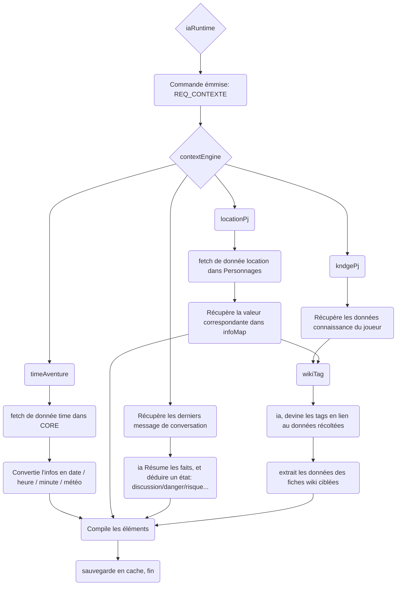

# Processus de l'outil contextEngine

iaRuntime à besoin d'un contexte cohérent pour fonctionner.
Pour créer un contexte cohérent, il faut que l'ia (via l'outil contextEngine) appel des sous-outils de récupération d'information

