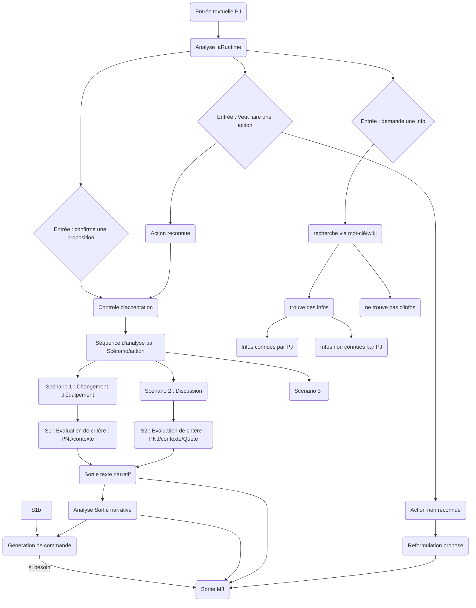

# Schéma iaRuntime

config :

look: handDrawn
theme: dark
  ---

```mermaid
flowchart TD;
    A(Entrée textuelle PJ)-->B(Analyse iaRuntime);
    B-->D{Entrée : confirme une proposition};
    D-->Fc;
    B-->F{Entrée : Veut faire une action};
    
    F-->Fa(Action reconnue);
    F-->Fb(Action non reconnue)
    Fa-->Fc(Controle d'acceptation)
    Fc-->Fd(Séquence d'analyse par Scénario/action)

    Fd-->S1(Scénario 1 : Changement d'équipement)
    S1-->S1a(S1 : Evaluation de critère : PNJ/contexte)
    S1a-->Z2
    S1b-->Z3a

    Fd-->S2(Scenario 2 : Discussion)
    S2-->S2a(S2 : Evaluation de critère : PNJ/contexte/Quete)

    S2a-->Z2(Sortie texte narratif)
    Z2-->Z3(Analyse Sortie narrative)
    Z3-->Z3a(Génération de commande)
    Z3a-->|si besoin|Z
    Z3-->Z
    Z2-->Z

    Fb-->Fe(Reformulation proposé)
    B-->G{Entrée : demande une info};
    G-->Ga(recherche via mot-clé/wiki)
    Ga-->Ga1(trouve des infos)
    Ga1-->Ga1a(Infos connues par PJ)
    Ga1-->Ga1b(Infos non connues par PJ)
    Ga-->Ga2(ne trouve pas d'infos)

    Fd-->S3(Scénario 3 : )

    Fe-->Z(Sortie MJ)
```

G(test)
