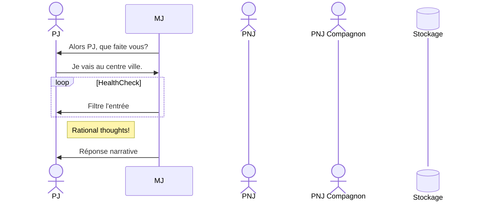

# Schéma de fonctionnement de iaRuntime par scénario

```mermaid
---
id: eca647e3-0a91-4ce7-9b23-7fcebeb78712
---
sequenceDiagram
actor PJ;
participant MJ;
actor PNJ;
actor PNJ Compagnon;
participant Stockage@{ "type" : "database" }
MJ->>PJ: Alors PJ, que faite vous?
PJ->>MJ: Je vais au centre ville.
loop HealthCheck
    MJ->>PJ: Filtre l'entrée
end
Note right of PJ: Rational thoughts!
MJ->>PJ: Réponse narrative
```
[Docu](https://mermaid.js.org/syntax/sequenceDiagram.html)